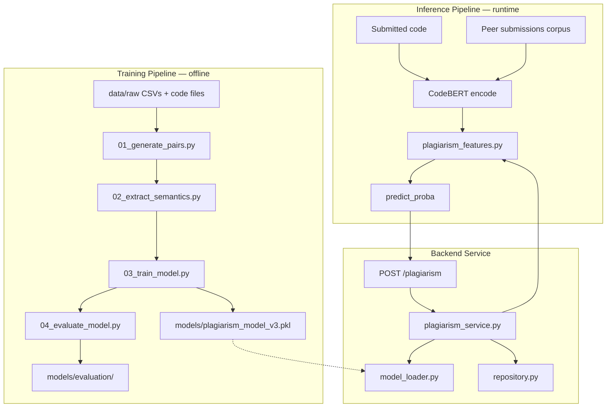

# EvalFlow Architecture

This document describes how training, inference, and the backend service fit together for plagiarism detection.

## Overview

## 1. Training pipeline

**Location:** `dataset/pipeline/`

**Purpose:** Build labeled pairwise features from synthetic/original submissions and train `plagiarism_model_v3.pkl`.

| Step | Script | What it does |
|------|--------|--------------|
| 1 | `01_generate_pairs.py` | Pair submissions within assignments; compute token, line, length, structure, and telemetry-gap features |
| 2 | `02_extract_semantics.py` | Embed code with `microsoft/codebert-base`; add `semantic_similarity` via cosine similarity |
| 3 | `03_train_model.py` | Train `RandomForestClassifier` (80/20 stratified split, `random_state=42`); save model + manifest |
| 4 | `04_evaluate_model.py` | Re-score held-out test split; save confusion matrix, classification report, metadata |

**Canonical constants:** `dataset/pipeline/_paths.py` (feature order, split params, model IDs).

**Outputs:**

- `dataset/data/processed/training_pairs_v2.csv`
- `dataset/data/processed/training_pairs_v3.csv`
- `dataset/models/plagiarism_model_v3.pkl`
- `dataset/models/plagiarism_model_v3.manifest.json`
- `dataset/models/evaluation/*`

## 2. Inference pipeline

**Location:** `backend/app/services/plagiarism_features.py` + `repository.py`

**Purpose:** Score a live submission against peer submissions for the same assignment.

For each candidate pair:

1. Load peer code and telemetry from `dataset/data/raw/`.
2. Embed both codes with `SentenceTransformer("microsoft/codebert-base")` and `encode(str(code))`.
3. Build the 10-feature vector in `compute_pairwise_features()` using the same formulas as training step 1 + cosine semantic similarity.
4. Run `predict_proba()` and return the highest pairwise probability.

**Manual/offline inference:** `backend/test_plagiarism.py` exercises the same service layer.

## 3. Backend service architecture

**Entry point:** `backend/app/main.py`

| Component | Role |
|-----------|------|
| `app/routers/plagiarism.py` | HTTP API; returns 503 if models failed startup verification |
| `app/services/plagiarism_service.py` | Orchestrates pairwise comparison and label mapping |
| `app/services/plagiarism_features.py` | Feature extraction (must match training) |
| `app/services/model_loader.py` | Loads RF + CodeBERT; verifies at startup |
| `app/services/repository.py` | Corpus + embedding cache |
| `GET /health` | Reports model/corpus readiness |

**Startup checks:**

- Random forest loads from `dataset/models/plagiarism_model_v3.pkl`
- CodeBERT loads and returns a non-empty probe embedding
- Submission corpus loads from `dataset/data/raw/`

If model verification fails, `/plagiarism` returns HTTP 503 instead of silently using zero vectors or heuristic fallbacks.

## Feature vector (index order)

Both training and inference use the same 10 features:

1. `token_similarity`
2. `line_similarity`
3. `length_similarity`
4. `structure_similarity`
5. `semantic_similarity`
6. `typing_speed_gap`
7. `idle_ratio_gap`
8. `paste_ratio_gap`
9. `tab_switch_gap`
10. `suspicion_gap`

## Model version record

See `dataset/models/plagiarism_model_v3.manifest.json` and `dataset/models/evaluation/evaluation_metadata.json` for:

- model version (`v3`)
- dataset file and row counts
- train/test split (`test_size=0.2`, `random_state=42`, stratified)
- classifier hyperparameters
- confusion matrix and classification report
